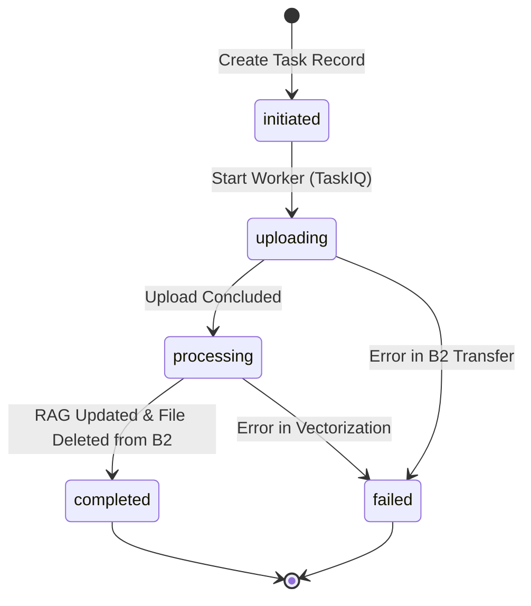

# Data Model: Ingestão de Dados & Gestão de Nuvem (Backblaze)

## Entities

### IngestionTask
Represents the lifecycle of a data ingestion process.

| Field | Type | Description |
|-------|------|-------------|
| `id` | UUID | Primary key. |
| `filename` | String | Original name of the file. |
| `file_hash` | String(64) | SHA256 hash for duplicate detection. |
| `status` | Enum | `initiated`, `uploading`, `processing`, `completed`, `failed`. |
| `remote_id` | String | ID of the file in Backblaze B2. |
| `error_message`| Text | Details if the task fails. |
| `progress` | Integer | Progress percentage (0-100). |
| `current_step` | String | Human readable current step for logs. |
| `created_at` | Timestamp | Task creation time. |
| `updated_at` | Timestamp | Last status change. |

**Constraints**:
- `file_hash` must be unique among tasks with status != `failed`. (Optional: depend on business rule for cleanup).
- `filename` is for display purposes only.

## State Transitions

## Relationships

- **IngestionTask** -> **KnowledgeBase** (Conceptual): Once completed, the task results are integrated into the vector store.
- **IngestionTask** -> **AuditLog**: Every transition is recorded as an audit entry.
